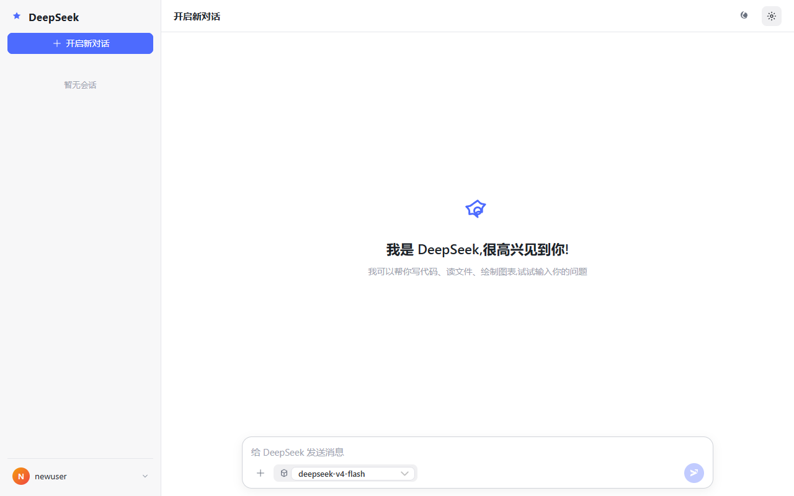
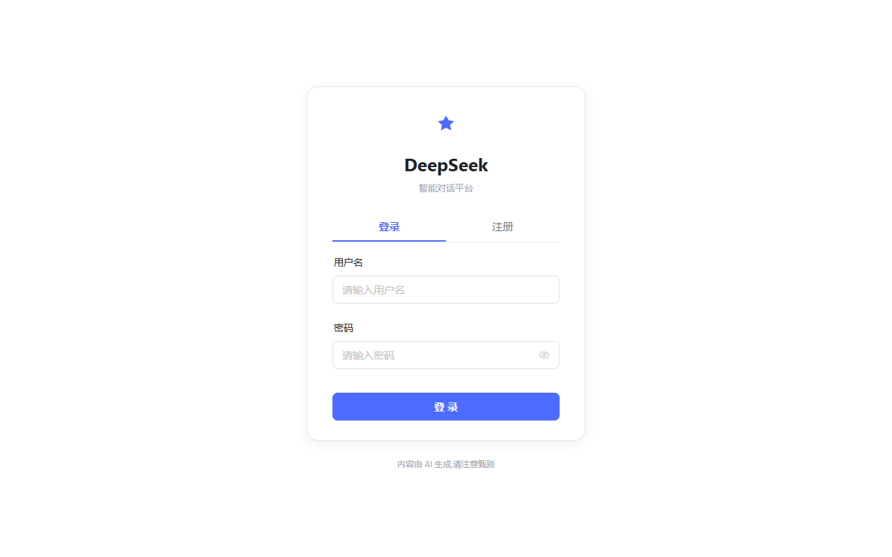
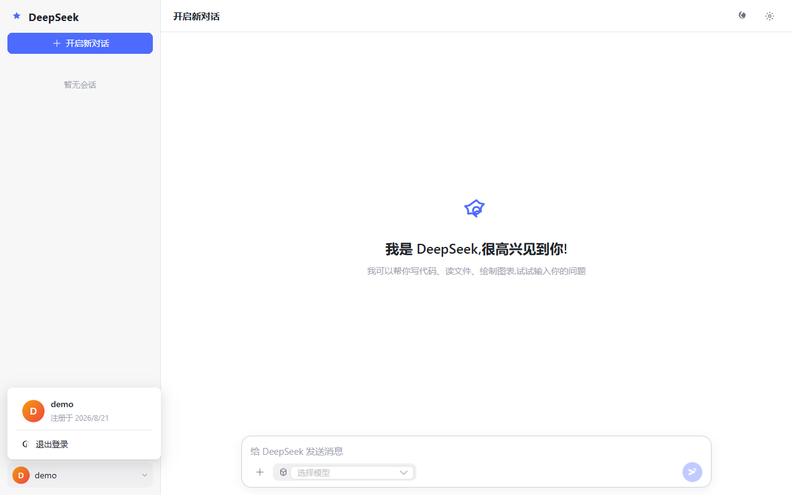
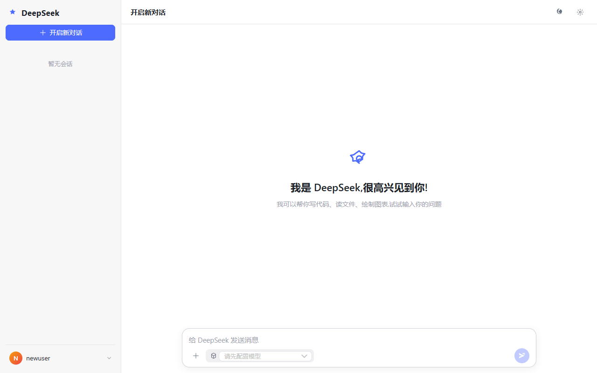
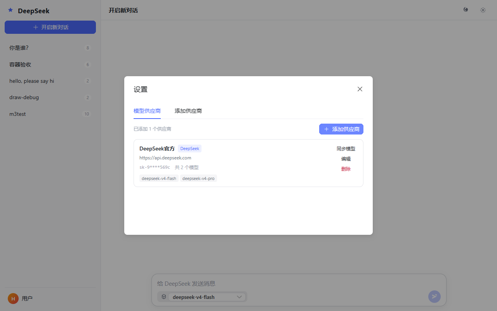
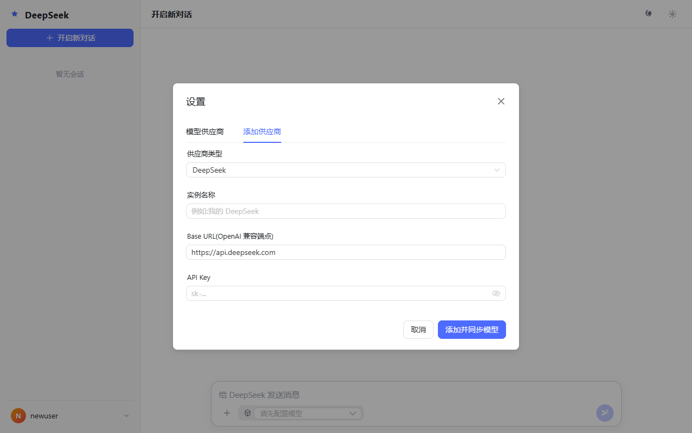
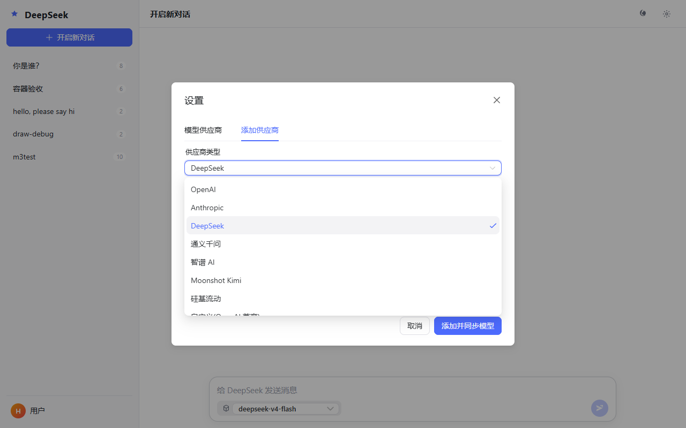
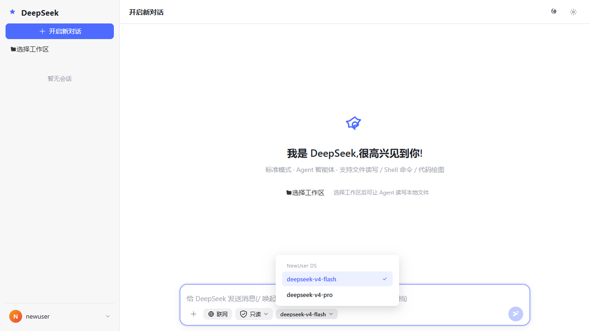
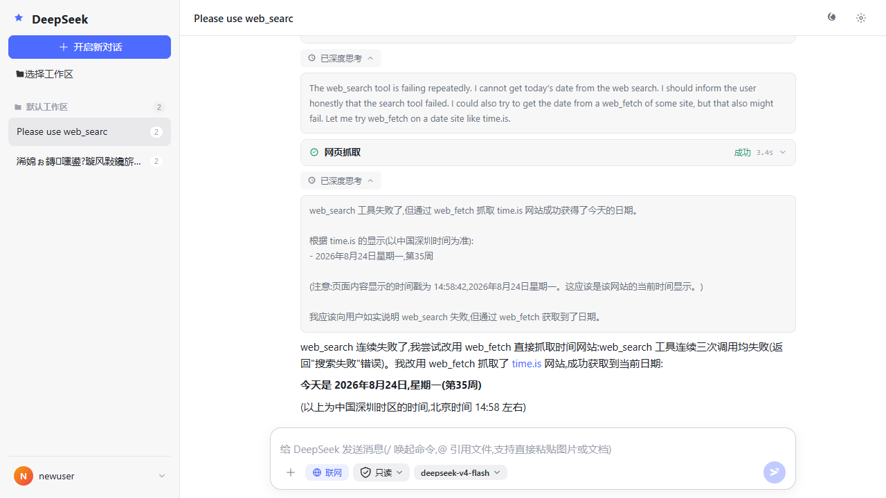
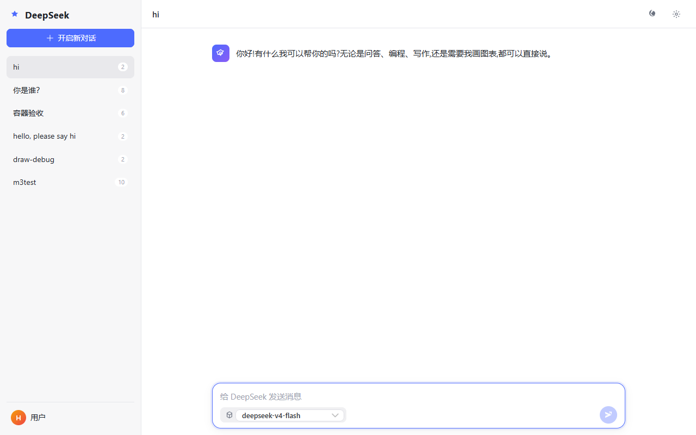

# LLM Chat — DeepSeek 风格 AI 对话平台

前后端分离的 AI 对话平台:前端对标 DeepSeek 网页版的交互,后端是一个**可治理的编程智能体运行时**。
单实例多用户,支持多 LLM 平台自助接入。

它不是"给模型套一层聊天 UI",重点在三件事:

- **工具能力**——读写改文件(`read_file` / `write_file` / `edit_file` / `glob` / `grep`)、执行 Shell、代码绘图、联网搜索;联网工具常驻,用不用由模型自行判断
- **治理边界**——三级权限(只读 / 工作区可写 / 全部权限)在**工具层强制**而非只靠提示词,路径穿越由唯一收口点拦截;危险操作与**计划评审**都在执行前挂起,等用户逐次批准
- **过程可见**——思考 / 工具 / 审批 / 压缩按真实执行顺序流式呈现,并落库为紧凑事件流,**刷新后精确回放**(不丢内容、不重排顺序)

这些机制的取舍大量参考 **DeepSeek Harness**(`plan-mode` / `filesystem` / `user-approval` / `compaction` 等子系统的源码与设计说明),并按本项目的规模做了简化 —— 例如计划模式是"软引导 + 审批门",而不是另起一套沙箱。

---

## 特性

### 平台层
- **多 LLM 平台自助接入**——WebUI 添加 OpenAI / Anthropic / DeepSeek / 通义千问 / 智谱 / Moonshot / 硅基流动 等 OpenAI 兼容平台;模型**手动录入**(模型名 + 输入上下文 + 最大输出),不再依赖 `{base_url}/models` 自动同步(保留「从端点发现模型名」辅助按钮,仅填表不写库)
- **内置供应商(.env)**——`OPENAI_API_KEY` / `OPENAI_API_BASE` / `DEFAULT_MODEL` / `BUILTIN_MODELS` 直接可用,模型下拉中固定为一个「内置模型」分组,**组内只展示 `BUILTIN_MODELS` 列出的模型**(形如 `模型名:输入上下文:输出上下文`,逗号分隔),`DEFAULT_MODEL` 作为默认选中项;未填 key 时该分组置灰。设置页只读展示该清单及其上下文
- **模型上下文规格**——每个模型可声明输入上下文与最大输出;输入上下文同时作为**上下文使用率圆圈的分母**与**自动压缩阈值基数**(1M 上下文的模型不会按 128k 默认值触发压缩),未声明时回退 `CONTEXT_WINDOW_DEFAULT`
- **跨平台统一模型 id**——`{provider_name}::{model_id}`,单一 chat 接口即可路由任意平台
- **多用户隔离**——所有对话/供应商/上传文件按 `user_id` 严格隔离

### 对话能力
- **流式输出**——SSE 逐 token 打字机;deepseek-reasoner 等思考模型输出 `reasoning` 事件
- **历史持久化**——会话/消息落入 PostgreSQL;agent 多轮记忆走 LangGraph checkpointer
- **Agent 智能体(标准模式)**——参考 DeepSeek Harness 的 persona + 工具引导分层提示词;`AgentManager` 按 `(model, permission, workspace, plan_mode)` 构建并 LRU 缓存图实例,工具集与提示词随会话动态装配
- **三级权限控制**——只读 / 工作区可写 / 全部权限;权限在**工具层强制**(`permission_gate`)而非仅靠提示词,`resolve_workspace_path` 做路径穿越防护;选"全部权限"需二次风险确认
- **工作区 / 命令 / 文件输入**——新对话可选择本地文件夹作为 Agent 读写根目录并持久化;输入框 `/` 唤起命令菜单(`/plan` `/compact`),`@` 选择工作区文件、内容注入上下文(**不显示在用户消息泡中**)
- **计划模式(参考 harness plan mode)**——`/plan` 进入后模型**只探索、只规划**:提示词注入计划模式 section 约束其不写文件/不改配置,准备就绪时用 `exit_plan_mode` 提交计划(以 `#` 标题开头的 Markdown)并挂起等待评审;审批卡按 Markdown 渲染计划全文,可「批准并开始实施」或「继续修改」(反馈作为工具结果回到模型)。计划门与权限档位**无关**(只读档位同样先批准),批准后 `plan_mode` 落库关闭,后续请求不再注入计划引导
- **完整思考与执行过程可视化**——思考过程 `ReasoningBlock`(流式实时展开 / 结束后自动折叠)+ 工具执行卡 `ToolCard`(名称 / 参数 / 状态 / 耗时 / 退出码 / 输出),按真实执行顺序交错渲染并持久化回放
- **联网搜索**——`web_search`(Tavily Search API)+ `web_fetch`(任意 URL) 为**常驻工具**,是否需要联网由模型自行判断,无手动开关
- **上下文自动压缩**——请求前按 token 占用预判(默认 `context_window × 0.7`)自动压缩;provider 报上下文超限时自动压缩并重试一次;压缩事件写入时间线,刷新后可见(见 `services/compaction.py`)
- **工具结果 spill**——超长工具输出(如 Shell/绘图/网页正文)落盘为 `spills/<id>.txt`,模型只看到「头尾预览 + `spill_id`」,需要细节时用 `read_spill` 分页读回,**中间内容不再被静态截断丢弃**
- **精确交错回放**——后端把增量事件按顺序合并成紧凑事件流存入 `meta.events`(含正文 delta),前端据此还原「正文 → 思考 → 工具 → 正文」的真实交错,而非"思考整体在前 + 正文整体在后";流式期间前端按**同一合并规则**累积事件(SSE 是逐 token 一帧,若不合并会把一次连续思考渲染成几十个思考块,且工具卡要刷新后才出现)
- **执行期人工审批**——`run_shell_command` / `write_file` / `edit_file` / `run_python_code` 执行前挂起,前端弹出审批卡逐次批准/拒绝,经 `Command(resume=...)` 从中断点继续。**审批挂「工作区可写」档**:对齐 harness 预设(`workspace-write` = ask、`danger-full-access` = never),即"日常安全模式会问、全部权限不再打扰";审批哪些工具由 `tools/registry.py` 的 `mutating` 声明(单一来源)。计划评审(`exit_plan_mode`)复用同一条链路,但**不受权限档位限制**
- **工具注册式装配**——工具在 `tools/registry.py` 注册(名称 / 工厂 / 审批元数据),建图时按会话上下文构建;注册期校验组名与工具名不重复、`mutating` 必须属于本组、工厂产出与声明一致(清单写错即启动报错)
- **关闭内置压缩**——通过 `register_harness_profile("openai", excluded_middleware={"SummarizationMiddleware"})` 移除 deepagents 内置的 summarization(其 offload 目标是虚拟路径、阈值 170k,与本项目压缩职责重叠),压缩统一由 `services/compaction.py` 负责
- **文件工具集(自研)**——`read_file` / `write_file` / `edit_file`(精确替换)/ `list_dir` / `glob` / `grep`,全部经 `resolve_workspace_path` 收口并受固定输出上限约束;deepagents 内置同名工具按「名字 + 来源」过滤移除(见 `agent/middleware.py`)
- **工具调用**——内置 `run_python_code`,matplotlib 绘图直接返回图片 URL;前端 `` 即时渲染
- **附件上传**——图片(预览展示)+ 本地文本文件(内容注入 prompt);20MB 限制,按扩展名白名单
- **图片识别(视觉模型)**——接入 `deepseek-v4-flash-vision-exp` 等视觉模型后,图片以 OpenAI 多模态 `image_url` 格式传递(本机图片自动转 base64 内联,外部模型无需回拉);模型与上下文规格由用户在设置中手动录入(可用「从端点发现模型名」辅助填表)

### 前端
- **深 / 浅 / 跟随系统 三态主题**——CSS 变量 + Naive UI darkTheme 联动;弯月图标 + Popover 下拉
- **用户认证**——JWT(HS256)+ bcrypt 风格 PBKDF2-SHA256;注册 / 登录 / 登出;路由守卫未登录自动跳 `/login`
- **响应式 UI**——长会话滚动隔离(消息区独立滚动,侧栏与输入框固定);无边框输入框;Markdown / 代码高亮 / 表格 / 图片
- **模型选择记忆**——模型为全局选择,切换对话 / 新建对话 / 刷新页面都沿用上次选中的模型(`localStorage`);选择失效(供应商被删或不可用)时回退 `DEFAULT_MODEL`,再回退第一个可用模型

---

## 技术栈

| 层 | 选型 |
|---|---|
| 前端 | Vue 3 + TypeScript + Vite + Pinia + Naive UI + markdown-it + highlight.js |
| 后端 | FastAPI + LangChain + deepagents + LangGraph(checkpointer)+ httpx |
| 数据库 | PostgreSQL 17 + Alembic 迁移 |
| 认证 | JWT(标准库 `jwt`)+ PBKDF2 密码哈希 |
| 部署 | Docker Compose(node 构建 + nginx 反代) |

---

## 界面预览

> 截图均为真实环境(本地 dev server + 后端容器)浏览器验证效果,存放于 [`docs/screenshots/`](docs/screenshots/)。

| 截图 | 说明 |
|---|---|
|  | 首页全貌:侧栏品牌 + 开启新对话 + 用户菜单 + 顶部弯月 / 设置;底部 "+" + 胶囊模型选择 |
|  | 登录 / 注册页(双 tab),首次打开未登录自动跳转 |
|  | 左下角用户菜单:头像 / 用户名 / 注册日期 / 退出登录 |
|  | 新用户首次登录:模型下拉显示 "请先配置模型" 引导 |
|  | 设置弹窗:供应商列表(实例名 / 类型徽章 / base_url / API Key 掩码 / 模型 chips) |
|  | 添加供应商表单:类型预设自动填 base_url,实例名 / API Key 关闭浏览器自动填充 |
|  | 供应商类型预设:OpenAI / Anthropic / DeepSeek / 通义 / 智谱 / Moonshot / 硅基流动 / 自定义 |
|  | 模型下拉按 provider 实例名分组(内置供应商显示为「内置模型」),显示完整模型名(与权限选择同款按钮样式) |
|  | 联网搜索结果:深度思考 → 工具卡(web_fetch) → 回答,按真实执行顺序交错渲染 |
|  | 流式对话:用户消息 → 助手回复 → 侧栏会话计数实时更新 |

---

## 架构

```
┌──────────────────────────────────────┐
│  前端 (Vue 3 SPA)                     │
│  ├─ Pinia stores                      │
│  │   ├─ auth      (JWT)               │
│  │   ├─ conversation(流式/pending/    │
│  │   │   工具记录/权限/工作区)        │
│  │   ├─ model / provider / theme      │
│  ├─ ChatInput  /命令 + @文件          │
│  ├─ ReasoningBlock + ToolCard 可视化   │
│  └─ Naive UI + CSS 变量主题           │
└──────────────┬───────────────────────┘
               │  JWT / SSE(增强 tool 事件)
┌──────────────▼──────────────────────┐
│  FastAPI (backend)                  │
│  ├─ api/auth / uploads / providers  │
│  ├─ api/conversations / workspaces  │
│  ├─ api/chat        SSE 流式        │
│  ├─ api/models      聚合动态        │
│  ├─ services/chat_service           │
│  │   落库 + agent 流式 + 持久化      │
│  ├─ agent/manager  (model+permission│
│  │   +workspace+plan_mode 构建图)     │
│  │   prompts.py(分层提示词)          │
│  │   bridge.py(事件→SSE 翻译)        │
│  ├─ tools/(权限感知工具集)           │
│  │   shell / filesystem / code_exec │
│  │   web_search / permissions       │
│  └─ core/registry 动态 provider     │
└──────────────┬──────────────────────┘
               │
   ┌───────────┼────────────┐
   │           │            │
   ▼           ▼            ▼
PostgreSQL   LLM 平台    /uploads /images
业务表 +    (多 OpenAI   上传静态 + 工具
checkpoint  兼容供应商)  生成的图片
```

**用户隔离**：`Depends(get_current_user)` 注入到所有 API,SQL 全部 `WHERE user_id = ?`。
**模型 id 全局唯一**：`{provider_name}::{model_id}` —— 跨平台切换不冲突,ModelRegistry 单例按 model_id 缓存 ChatOpenAI 实例。
**Agent 权限强制**：工具层 `permission_gate` 按会话权限拦截写/命令操作,`resolve_workspace_path` 校验所有文件路径防 `..` 穿越;`workspace_root`/`permission`/`plan_mode` 作为 Agent 图实例缓存 key,变化即重建(计划模式同时改变提示词与工具集)。
**附件拼接**：图片用 markdown ``,文本文件内嵌 `--- 文件名 --- 内容 ---`,仅拼入发给 LLM 的 prompt;**落库的用户消息只存原始输入**,刷新后用户泡不会回显文件内容。

### 一次请求发生了什么

**普通对话**

```
POST /api/chat ──► 落库 user 消息
                  ├─ 请求前:上下文占用过高?→ 自动压缩(SSE: compact)
                  ├─ AgentManager 取/建图(key = model + permission + workspace + plan_mode)
                  ├─ astream_events ──► bridge.py 翻译 ──► SSE: delta / reasoning / tool
                  └─ 收尾:落库 assistant(reasoning / segments / events / usage)→ SSE: done
```

**执行期人工审批(危险操作 / 计划评审)**

```
同一回合中途 ──► 工具命中 interrupt_on → HumanInTheLoopMiddleware 挂起
                 └─ **本轮流就此结束**(不发 done),SSE: approval{actions}
前端审批卡 ──► POST /api/chat/approve{decisions}
                 ├─ 批准的是计划 → plan_mode 落库置 false(下一条消息起不再注入计划引导)
                 └─ Command(resume=decisions) 沿用**产生中断的那个图**继续流式 → done
```

> 恢复必须沿用同一个图:中间件在恢复时会重放 `after_model`,要重新用 `interrupt_on` 取审批配置,
> 并在批准后把工具调用交回 ToolNode 执行 —— 换成"另一个模式"的新图会既匹配不到配置、又找不到工具。

---

## 快速开始

### 方式一:全 Docker 部署(推荐生产 / 验收)

```bash
cd D:\study\llm

# 1. 准备配置(已含默认环境变量,需要时编辑)
#    .env 里可填 OPENAI_API_KEY / OPENAI_API_BASE / DEFAULT_MODEL 启用内置模型分组
#    其余供应商 API key 与登录用户都在 WebUI 内自助配置,不需要预先填

# 2. 构建并启动全部容器(db + backend + web)
docker compose up -d --build

# 3. 首次建表
docker compose exec backend alembic upgrade head

# 4. 访问
#    WebUI: http://localhost:3000  (nginx 反代 /api、/images、/uploads → backend)
#    后端:  http://localhost:8000
```

> 浏览器打开 WebUI → 注册账号 → 开始对话。
> 模型来源有两处:`.env` 的内置供应商(分组「内置模型」,填了 `OPENAI_API_KEY` + `BUILTIN_MODELS` 即可直接用);或在**设置 → 供应商**里添加平台(选预设 / 填 base_url / 填 API Key,再手动录入模型名与输入/输出上下文)。

### 方式二:本地开发(uv 管理,支持 reload)

```bash
cd D:\study\llm

# 1. 起数据库(仅 db 容器)
docker compose up -d db

# 2. 启动后端(uv 虚拟环境 + 热重载)
cd backend
uv sync                          # 按 pyproject.toml + uv.lock 安装依赖
cp ../.env.example .env          # 编辑填入 JWT_SECRET 等
                                 # 内置供应商:OPENAI_API_KEY / OPENAI_API_BASE / DEFAULT_MODEL
                                 # 需要联网搜索时再填 TAVILY_API_KEY(https://tavily.com)
uv run alembic upgrade head
uv run python run.py             # http://localhost:8000 (RELOAD=0 可关闭热重载)

# 3. 启动前端(另一终端)
cd ../web
npm install
npm run dev                      # http://localhost:5173
```

> Docker 构建时用 `uv sync --frozen` 安装锁文件依赖;镜像内以 `uv run uvicorn app.main:app --host 0.0.0.0 --port 8000` 启动(Linux 事件循环可直接用 uvicorn,不需要 Windows 下的 `run.py` 适配)。

---

## API 契约

统一前缀 `/api`。**SSE 端点用 `fetch POST + ReadableStream` 解析**(EventSource 只支持 GET)。

### 认证

| 方法 | 路径 | 说明 |
|---|---|---|
| POST | `/api/auth/register` | `{username, password}` → `{access_token, token_type}` |
| POST | `/api/auth/login` | 同上 |
| GET  | `/api/auth/me` | 当前用户信息(需 `Authorization: Bearer <token>`) |

### 对话

| 方法 | 路径 | 说明 |
|---|---|---|
| GET    | `/api/models`             | 聚合内置供应商(`.env` 的 `BUILTIN_MODELS` 清单)+ 当前用户已配置供应商的手动模型;每项带 `input_tokens`/`output_tokens`,并附带 `default_model`(即 `DEFAULT_MODEL` 的全局 id) |
| POST   | `/api/conversations`      | `{title, permission?, workspace_path?, plan_mode?}` → 201 |
| PATCH  | `/api/conversations/{id}` | 更新权限 / 工作区 / 计划模式 |
| GET    | `/api/conversations`      | 列表(含 permission / workspace_path / plan_mode) |
| GET    | `/api/conversations/{id}/messages` | 升序消息 |
| DELETE | `/api/conversations/{id}` | 204 + 级联删消息 + 清 checkpointer |
| PUT    | `/api/workspaces/{id}`    | 设置会话工作区(绝对路径,后端校验存在性) |
| GET    | `/api/workspaces/browse`  | 浏览本地目录(文件窗口式选择工作区) |
| GET    | `/api/workspaces/{id}/files` | 列出工作区目录/文件(`@` 引用用) |
| GET    | `/api/workspaces/{id}/read`  | 读取工作区文件内容 |
| POST   | `/api/chat`               | SSE 流式(见下)|
| POST   | `/api/chat/approve`       | 人工审批后恢复:提交 `{conversation_id, model, decisions:[{type:"approve"\|"reject", message?}]}`(`message` 仅拒绝时使用,作为工具结果回传模型 —— 计划「继续修改」的反馈走这里),返回继续执行的 SSE 流;批准计划时同时把 `plan_mode` 置 false |

### 供应商

| 方法 | 路径 | 说明 |
|---|---|---|
| GET    | `/api/providers`                | 列表(api_key 已掩码)|
| POST   | `/api/providers`                | 创建(模型由 `models` 字段手动录入) |
| PUT    | `/api/providers/{id}`           | 更新(含覆盖模型清单) |
| DELETE | `/api/providers/{id}`           | 删除 |
| POST   | `/api/providers/{id}/sync`      | **只发现不写库**:调用 `{base_url}/models` 返回候选模型名,供前端填表后由用户补上下文 |

### 上传

| 方法 | 路径 | 说明 |
|---|---|---|
| POST | `/api/uploads` | `multipart/form-data` 字段名 `file`;返回 `{url, filename, kind, size}` |
| GET  | `/uploads/{kind}/{user_id}/{file}` | 静态访问(图片直接 ``,文本文件直接链接下载) |

支持类型：图片 `png/jpg/jpeg/gif/webp/bmp`;文件 `txt/md/py/js/ts/json/csv/log/html/css/xml/yaml/yml/sh/sql/ini/cfg/toml/java/c/cpp/h/go/rs/rb`。单文件 20MB 上限。

### POST /api/chat

```json
{
  "conversation_id": "<uuid>",
  "model": "DeepSeek官方::deepseek-v4-flash",
  "message": "画 y=sin(x)",
  "attachments": [
    {"url": "/uploads/images/<uuid>/xxx.png", "filename": "图.png", "kind": "image"},
    {"url": "/uploads/files/<uuid>/a.py", "filename": "a.py", "kind": "file", "content": "print('hi')"}
  ]
}
```

SSE 帧:`event: <name>\ndata: <JSON>\n\n`,事件顺序:`delta`/`reasoning` 若干 → `tool` 若干 → `done`(或 `error`,二者互斥)。

| 事件 | data | 说明 |
|---|---|---|
| `delta`     | `{type, content}` | token 级打字机 |
| `reasoning` | `{type, content}` | 思考模型(DeepSeek Reasoner 等);**逐 token 一帧**,前端按「相邻同类合并」累积成一个思考块,与落库的 `meta.events` 保持一致 |
| `tool`      | `{type, name, status:"start"/"end", args?, result?, started_at?, duration_ms?, exit_code?, ok?}` | 工具调用;`start` 带 `started_at`,`end` 带耗时 / 退出码 / 成功态;绘图工具 end 时 `result` 为结构化 JSON 含 `image` 字段 |
| `compact`   | `{type, ok, summary, message}` | 上下文已压缩(请求前预判触发 / 溢出后恢复到重试);写入 segments,刷新后仍展示 |
| `approval`  | `{type, actions:[{name, args}]}` | 挂起等待人工审批:危险操作,或计划模式下的 `exit_plan_mode` 计划评审(此时 `args.plan` 是完整 Markdown,前端按 Markdown 渲染);**本帧后流即结束(不发 `done`)**,前端展示审批卡并调用 `/api/chat/approve` 恢复 |
| `done`      | `{type, message_id, model, images, usage}` | 正常结束 |
| `error`     | `{type, code, message}` | 错误码:`model_not_found` / `provider_key_missing` / `conversation_not_found` / `upstream_error` / `tool_error` / `internal`;前置校验失败直接 4xx JSON |

---

## 目录结构

```
.
├── backend/
│   ├── app/
│   │   ├── api/          # auth, uploads, providers, models, chat, conversations, workspaces
│   │   ├── core/         # config, security (JWT), registry (动态 provider)
│   │   ├── db/           # models (User/Provider/Conversation/Message), checkpointer
│   │   ├── schemas/      # Pydantic
│   │   ├── services/     # chat_service (SSE 组装 + 流式 + 工具记录持久化)
│   │   ├── agent/        # manager(按 model+permission+workspace+plan_mode 构建),
│   │   │                 # prompts.py(分层提示词,含计划模式 section),
│   │   │                 # bridge.py(事件→SSE 翻译), profile.py(harness profile),
│   │   │                 # middleware.py(移除内置工具,保留自研同名工具)
│   │   ├── tools/        # registry(注册式装配 + 审批元数据)/ shell / filesystem
│   │   │                 # (read/write/edit/list/glob/grep)/ code_exec / web_search
│   │   │                 # plan(exit_plan_mode)/ spill / permissions
│   │   └── main.py
│   ├── alembic/          # 迁移(权限/工作区/摘要/计划模式)
│   ├── pyproject.toml + uv.lock   # uv 管理依赖
│   ├── Dockerfile
│   └── run.py            # Windows 入口(SelectorEventLoop)
├── web/
│   ├── src/
│   │   ├── api/          # auth, uploads, providers, models, conversations, workspaces, stream
│   │   ├── stores/       # auth, model, conversation, provider, theme
│   │   ├── pages/        # LoginPage, ChatPage
│   │   ├── components/chat/   # ChatInput(/命令 @文件)、CommandMenu、FileMention、
│   │   │                        ReasoningBlock、ToolCard、ApprovalCard(含计划评审)、
│   │   │                        PermissionSelect、PlanModeChip、WorkspaceSelect
│   │   ├── components/   # layout, conversation, settings, common
│   │   ├── composables/  # useAutoScroll
│   │   ├── utils/        # asset (URL 解析), markdown (markdown-it 单例)
│   │   ├── styles/       # variables (双主题), base, markdown
│   │   └── App.vue + main.ts + router
│   ├── Dockerfile        # node 构建 + nginx
│   └── nginx.conf        # /api /images /uploads 反代 + SPA fallback
├── docker-compose.yml    # db + backend + web 三服务
├── docs/screenshots/     # README 引用的截图
├── .env.example
├── plan.md               # Agent 智能体改造计划
└── README.md
```

---

## 常见问题

- **Windows 启动报 `Psycopg cannot use the 'ProactorEventLoop'`** ——必须用 `python run.py`(注入 SelectorEventLoop);直接 `uvicorn app.main:app` 会失败
- **改代码不生效** ——后台 / 自动化 `RELOAD=0`(Windows 上 reloader 孤儿进程可能占住端口;残留进程 `netstat -ano | findstr :8000` + `taskkill //F //PID <pid>` 清理)
- **API2D 等 base_url 缺 `/v1`** ——保存时后端自动 fallback `/v1/models`,成功后回写规范化的 base_url,chat 同端点不会 404
- **CORS** ——开发期 `allow_origins=["*"]`(后端配置),上生产前请收紧
- **JWT_SECRET** ——`.env` 默认有占位值,生产环境务必修改为强随机字符串
- **联网搜索报"未配置"** ——未设置 `TAVILY_API_KEY`,在 `backend/.env` 填入后重启后端(改 `.env` 不会热重载)
- **打开工作区弹窗偶尔要等半秒** ——盘符枚举改用 Win32 API(`GetLogicalDrives`/`GetDriveTypeW`)已避开断开的映射网络驱动器的 SMB 超时(此前会卡 ~40 秒);剩下的半秒是对**网络驱动器**做连通性探测的超时窗口(`DRIVE_PROBE_TIMEOUT`),没有网络驱动器时是毫秒级

---

## 安全说明

- `run_python_code` 在子进程执行 LLM 生成的代码(与后端同权限),属未受信输入。已做:60s 超时 + 进程树清理、env 剔除密钥、输出截断。**个人学习项目可接受;若要暴露公网,建议将代码执行迁移到隔离容器 / 沙箱**。
- `run_shell_command` 沙箱化:超时 + cwd 限制在工作区、stdout/stderr 截断、剔除含 KEY/TOKEN/SECRET 的环境变量、并发信号量限流。
- 文件工具全部经 `resolve_workspace_path` 防穿越;只读权限强制只读打开并拦截写操作。
- 联网工具为只读性质,`web_fetch` 限制 http/https 协议 + 响应大小上限 + 超时;`web_search` 走 Tavily,API Key 只存于后端 `.env`,不下发前端。
- API Key 仅存于数据库(用户自己账户下),前端不回传明文,仅展示 `sk-xx****xxxx` 掩码。
- 密码用 PBKDF2-SHA256 加盐哈希,不存明文。

---

## 里程碑

- M0 骨架 + 数据库 ✅
- M1 模型注册 + SSE ✅
- M2 历史对话 ✅
- M3 deepagents + 绘图工具 ✅
- M4 容器化 ✅
- M5 用户认证 + 路由守卫 + JWT ✅
- M6 动态供应商 WebUI 管理 ✅
- M7 附件上传(图片 / 文件) + 用户隔离 ✅
- M8 Agent 智能体改造(标准模式 / 三级权限 / 工作区 / `/` 命令 / `@` 文件引用 / 思考与工具执行可视化)✅
- M9 联网搜索(web_search + web_fetch 常驻工具,由模型自行判断是否联网)✅
- M10 对标 harness 的执行内核:自动上下文压缩 + 工具结果 spill + 事件流精确回放 + 执行期人工审批 ✅
- M11 计划模式(`/plan`):提示词 section 软引导 + `exit_plan_mode` 评审工具 + Markdown 计划审批卡 ✅