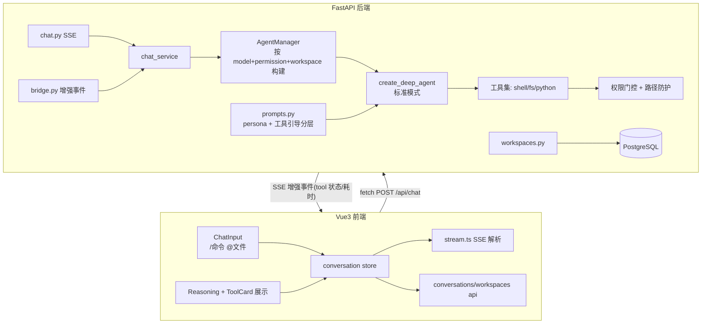

# 改造计划：将 LLM Chat 平台升级为类 DeepSeek Harness 的 Agent 智能体

> 计划版本：v1.1（已确认）
> 说明：本计划为完整改造方案，写入根目录 `plan.md`，不改动原 `README.md` 与 `backend/plan.md`。
> v1.1 变更：按用户要求**不实现 DeepSeek Harness 的轨迹（Trajectory）功能**，思考与工具执行过程用现有 ReasoningBlock + ToolCard 展示并增强状态/耗时信息。

---

## 产品概述

将现有 DeepSeek 风格的对话平台改造成具备文件系统操作与命令执行能力的 Agent 智能体平台。仅实现标准模式 Agent 预设、权限控制、工作区/文件/命令输入、执行过程可视化四类功能，不引入 DeepSeek Harness 的 React/Cordis 架构，仅参考其 WebUI 的交互与视觉呈现，并沿用其 persona + 工具引导的提示词分层设计。

## 核心功能

### 1. Agent 预设（标准模式）

- 仅提供"标准模式"单一预设，可在对话头部选择。
- 参考 DeepSeek Harness 标准模式（`apps/cli/config/agent-presets/standard/`）：功能完整的编码 Agent，具备 Shell 命令、文件读写、文件搜索、代码执行等能力。

### 2. 权限控制（三级）

| 权限 | 能力 |
|---|---|
| 只读（read_only） | 仅可读取工作区/项目文件，禁止写文件与执行命令 |
| 工作区可写（workspace_writable） | 可在所选工作区内读写文件、执行命令，不可越出工作区边界 |
| 全部权限（full_access） | 不受限制地读写与执行命令；选择该权限需二次风险确认弹窗 |

- 权限在工具层强制生效（不只靠 system prompt 约束），并对工作区路径做穿越防护。
- 权限仅对新建会话生效；已存在会话保留原权限，切换权限仅影响后续步骤。

### 3. 命令 / 文件 / 工作区输入

- 输入框支持 `/` 命令（如 `/help`、`/clear` 等预设命令）唤起命令菜单。
- 输入 `@` 可弹出本地文件选择器，将所选文件内容作为上下文注入当前消息。
- 新对话/空会话态可选择本地文件夹作为工作区，作为 Agent 读写文件的根目录；会话记录并持久化工作区与权限配置。

### 4. 完整思考与执行过程可视化（WebUI）

- 展示思考过程（reasoning）与最终文本输出。
- 展示每步工具调用（命令/文件操作）的名称、参数、执行结果、状态（运行中/成功/失败）与耗时。
- 按用户要求**不实现 DeepSeek Harness 的轨迹（Trajectory）时间轴视图**，仅用现有 `ReasoningBlock`（思考折叠）+ `ToolCard`（工具执行卡）呈现，并为工具卡补充状态与耗时信息。

## 技术栈选择

沿用现有项目技术栈，不引入新框架：

- 后端：FastAPI + SQLAlchemy(asyncpg) + PostgreSQL + langchain/deepagents(0.6.12) + LangGraph checkpointer
- 前端：Vue3 + TypeScript + Vite + Naive UI + Pinia + vue-router
- 新增：自研沙箱化 Shell 命令/文件系统工具，扩展 SSE 事件契约承载工具执行状态与耗时

## 实现方案

### 后端改造

1. **权限模型与数据库**：`Conversation` 表新增 `permission`（read_only/workspace_writable/full_access，默认 read_only）与 `workspace_path`（可选）字段，新增 Alembic 迁移；`workspace_path` 存用户所选工作区的绝对路径，并做用户隔离校验。

2. **工作区管理**：新增 `/api/workspaces` 端点，支持设置/读取会话工作区。前端通过浏览器目录选择（`showDirectoryPicker`，fallback 为手工输入路径）获取路径后交给后端登记并校验存在性。

3. **标准模式 Agent 升级**：`AgentManager` 改为按 `(model_id, permission, workspace_root)` 构建图实例；按权限动态装配工具集：

   - `run_shell_command`（执行 shell，仅 workspace_writable/full 可用，cwd=workspace_root）
   - `read_file` / `write_file` / `list_dir`（文件操作，含路径穿越防护）
   - `run_python_code`（保留绘图能力，按权限限制 cwd 与写文件）
   - 全工具统一注入 `workspace_root` 与 `permission`（resolve 后必须位于工作区内，只读权限强制只读打开）。

4. **工具层权限强制**：实现权限感知工具工厂 `make_agent_tools(permission, workspace_root)`，`permission_gate` 在工具被调用时校验权限并拦截越权，杜绝仅靠提示词。

5. **系统提示词分层**：沿用 Harness 的 persona + 工具引导模式，重写 `prompts.py`：

   - Persona（order 0）：`You are a coding agent powered by the {{model}} model. Your working directory is {{cwd}}.`（注入模型名与工作区路径）
   - 工具引导（order 100-199）：每个工具注册一条引导文案，参考 Harness read/write/shell 的措辞并适配我们的工具集
   - 权限边界 section：明确说明当前权限下可用/禁用的能力
   - 动态注入：cwd、permission、workspace_root 作为 prompt 变量按会话解析。

6. **SSE 事件契约扩展**：增强 `tool` 事件补充 `started_at`、`duration_ms`、`status`、`exit_code`。`bridge.py` 翻译时记录工具耗时与状态。

7. **工具执行记录持久化**：扩展 `Message.meta` 存储工具调用记录（含耗时/状态/参数/结果），供刷新后回放执行过程。

### 前端改造

1. **输入区升级**：`ChatInput.vue` 增加 `/` 命令触发与 `@` 文件选择触发；命令菜单、文件选择菜单复用现有附件上传逻辑。

2. **会话配置栏**：新增标准模式预设选择（仅标准模式一项）与权限选择器（三级），权限选"全部"时弹 Naive UI 风险确认弹窗；空会话态提供"选择工作区"入口（目录选择器）。

3. **执行过程展示**：扩展现有 `ReasoningBlock`（思考折叠）与 `ToolCard`（工具调用卡：名称/状态/耗时/参数/结果），`AssistantMessage` 组装工具执行记录与思考展示。**不实现 TrajectoryView / StepCard 轨迹视图**（按用户要求）。

4. **Store 与类型扩展**：`conversation` store 扩展 pending 结构承载工具执行记录与状态；`types/index.ts` 增加权限/工作区类型与工具记录字段；`stream.ts` 解析新增 SSE 字段。

## 实现注意事项

- 路径安全：所有文件工具统一经 `resolve_workspace_path` 校验，`..` 穿越与工作区外路径一律拒绝；只读权限强制只读打开并禁止写操作。
- 命令执行沙箱：`run_shell_command` 设置 `cwd=workspace_root`、超时、stdout/stderr 截断、剔除含 KEY/TOKEN/SECRET 的 env 变量；并发信号量限流（复用 code_exec 现有模式）。
- 提示词注入安全：cwd/模型名等变量注入前做转义，避免提示词注入。
- 向后兼容：旧的纯绘图消息与 SSE 事件保持可解析，前端对缺省字段做容错。
- 日志：复用现有 logger，命令/文件操作记录执行摘要但不落密钥与超长输出。

## 系统架构



## 目录结构

```
d:/study/llm/
├── plan.md                        # [NEW] 完整改造计划（用户指定，不改 README）
backend/
├── alembic/versions/
│   └── add_agent_permission_workspace.py   # [NEW] Conversation 增列
├── app/
│   ├── agent/
│   │   ├── manager.py      # [MODIFY] 按 (model, permission, workspace) 构建；装配权限化工具集
│   │   ├── prompts.py      # [MODIFY] persona + 工具引导分层，权限/工作区动态注入
│   │   └── bridge.py       # [MODIFY] 增强 tool 事件（状态/耗时）
│   ├── tools/
│   │   ├── permissions.py  # [NEW] 权限常量/门控工厂 + workspace_root 解析
│   │   ├── shell.py        # [NEW] run_shell_command 沙箱执行工具
│   │   ├── filesystem.py   # [NEW] read_file/write_file/list_dir，含路径防护
│   │   └── code_exec.py    # [MODIFY] 适配权限/工作区
│   ├── schemas/
│   │   ├── conversation.py # [MODIFY] ConversationOut 增加 permission/workspace
│   │   ├── chat.py         # [MODIFY] ChatRequest 传递权限/工作区（或服务端读取会话）
│   │   └── workspace.py    # [NEW] 工作区相关 schema
│   ├── api/
│   │   ├── chat.py         # [MODIFY] 读取会话权限/工作区
│   │   └── workspaces.py   # [NEW] 工作区设置/读取端点
│   ├── services/
│   │   └── chat_service.py # [MODIFY] 传权限/工作区给 agent；持久化工具执行记录
│   └── db/models.py        # [MODIFY] Conversation 增列
web/
└── src/
    ├── types/index.ts      # [MODIFY] 权限/工作区类型与工具记录字段
    ├── api/
    │   ├── stream.ts       # [MODIFY] 解析增强 SSE 字段
    │   ├── conversations.ts# [MODIFY] 携带权限/工作区
    │   └── workspaces.ts   # [NEW] 工作区 API
    ├── stores/conversation.ts # [MODIFY] 扩展 pending 工具记录/状态
    ├── components/
    │   ├── chat/
    │   │   ├── ChatInput.vue      # [MODIFY] /命令与@文件触发
    │   │   ├── AssistantMessage.vue# [MODIFY] 组装工具执行记录与思考
    │   │   ├── CommandMenu.vue    # [NEW] /命令菜单
    │   │   ├── FileMention.vue    # [NEW] @文件选择
    │   │   └── ToolCard.vue       # [MODIFY] 增强状态/耗时展示
    │   └── layout/
    │       └── ChatHeader.vue     # [MODIFY] 预设/权限/工作区选择入口
    └── pages/ChatPage.vue         # [MODIFY] 空会话态工作区选择
```

## 关键代码结构（提示词分层，沿用 Harness 模式）

```python
# backend/app/agent/prompts.py —— persona + 工具引导分层
PERSONA = (
    "You are a coding agent powered by the {{model}} model. "
    "Your working directory is {{cwd}}."
)
# 工具引导 section（order 100-199），参考 Harness read/write/shell 措辞
TOOL_GUIDANCE = {
    "read_file": "Use the read_file tool — not shell commands like cat — to inspect text files. Results include line numbers.",
    "write_file": "Use the write_file tool to create files or completely replace file contents. Prefer read first.",
    "run_shell_command": "Use run_shell_command to execute shell commands. The working directory is the workspace root.",
}
# 权限边界 section
def build_permission_section(permission: str, workspace_root: str | None) -> str: ...
```

## 权限模型

```python
PERMISSION_READ_ONLY = "read_only"          # 只读：仅读文件，禁写禁命令
PERMISSION_WORKSPACE = "workspace_writable" # 工作区可写：工作区内读写+命令
PERMISSION_FULL = "full_access"             # 全部：不受限读写+命令（需风险确认）

def permission_gate(permission: str, *, need_write: bool, need_shell: bool) -> None: ...
def resolve_workspace_path(path: str, workspace_root: Path) -> Path: ...  # 防穿越
```

## 页面与布局

- 顶部/头部栏：标准模式预设选择（单一标识）、权限选择器（只读/工作区可写/全部），全部权限选中时弹出风险确认弹窗；右侧展示当前工作区路径（有则显示，可重新选择）。
- 空会话态：居中卡片展示"选择工作区"入口与"开始新对话"引导，工作区通过目录选择器完成。
- 输入区：支持 `/` 命令与 `@` 文件选择触发，命令/文件菜单为浮层；保留附件上传与模型选择。
- 消息区：用户消息上方可展示当前轮次的权限/工作区徽标；Assistant 消息折叠展示思考、逐条展开工具执行卡（名称/状态图标/耗时/参数/输出）、最终 Markdown 输出。

## 交互与动效

- 工具运行中状态用 accent 色 + 旋转动画提示；成功用 success 色勾选，失败用 danger 色。
- 工具卡展开/收起平滑过渡，参数与 stdout 使用等宽字体代码块。
- 权限切换与工作区选择有即时视觉反馈；全部权限确认弹窗带强提醒样式。

## 响应式

- 消息区与输入区保持现有最大宽度对齐；侧栏与头部在窄屏下可折叠。

## 视觉风格

- 采用现代、精密的开发者工具风格，在现有 Naive UI 变量体系（--bg/--accent/--border）上扩展，突出"执行过程可视化"的信息层次。
- 整体保持深色优先、卡片化、强调色用于运行状态，动效克制但清晰。
